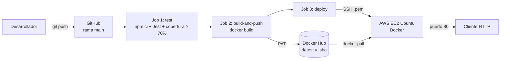

# Práctica 3 – API REST de Biblioteca con CI/CD (Docker + GitHub Actions + AWS EC2)

API REST de una biblioteca construida con **Node.js 22**, **Express 5** y **SQLite** (`better-sqlite3`).
Cada `push` a `main` ejecuta las pruebas, publica la imagen en **Docker Hub** y la despliega
automáticamente en una instancia **AWS EC2**.

- **11 endpoints** (ver tabla al final)
- **51 pruebas** de integración con **Jest + Supertest**, cobertura ≈ **96%** (mínimo exigido: 70%)
- Imagen Docker multi-etapa, usuario sin privilegios y `HEALTHCHECK`

---

## 1. Arquitectura



| Componente | Detalle |
|---|---|
| Aplicación | Express 5, rutas en `src/routes/`, acceso a datos en `src/db/` |
| Base de datos | SQLite normalizada (3FN), archivo en `data/practica3.db` (volumen Docker en EC2) |
| Pruebas | `tests/`, BD en memoria (`DB_PATH=:memory:`), no tocan los datos reales |
| Contenedor | `Dockerfile` en dos etapas, la app escucha en el puerto 3000 del contenedor |
| CI/CD | `.github/workflows/main.yml` con 3 jobs: `test` → `build-and-push` → `deploy` |
| Servidor | EC2 Ubuntu con Docker; el contenedor se publica en el puerto **80** (`-p 80:3000`) |

### Flujo del pipeline

1. **test** (en push y pull request): instala dependencias, ejecuta `npm run test:ci` y muestra la tabla
   de cobertura en los logs y en el resumen del job. Si la cobertura baja del 70%, el pipeline falla.
2. **build-and-push** (solo push a `main`): inicia sesión en Docker Hub con un *Personal Access Token*,
   construye la imagen y la publica con las etiquetas `:latest` y `:<sha del commit>`.
3. **deploy** (solo push a `main`): se conecta a la EC2 por SSH, descarga `:latest`, detiene y elimina
   el contenedor anterior, levanta el nuevo en el puerto 80 y verifica que la API responde.

La imagen nueva se descarga **antes** de detener la anterior, así que la interrupción es de
uno o dos segundos. Los datos se guardan en los volúmenes `practica3-data` y `practica3-backups`,
por lo que no se pierden entre despliegues.

### Base de datos (3FN)

- **categorias** (id, nombre)
- **autores** (id, nombre, nacionalidad)
- **libros** (id, titulo, isbn, anio_publicacion, autor_id → autores, categoria_id → categorias)

### Formato de respuesta

Todas las respuestas (incluidos los errores) usan el mismo esquema; `data` siempre es un arreglo:

```json
{ "statusCode": 200, "data": [] }
```

---

## 2. Comandos locales

Requisitos: Node.js 22 o superior (y Docker para probar la imagen).

```bash
npm install                # instalar dependencias
npm start                  # API en http://localhost:3000
npm run dev                # modo desarrollo (se reinicia al guardar)
npm test                   # pruebas
npm run test:coverage      # pruebas + reporte de cobertura (carpeta coverage/)
```

Para probar los endpoints abre `practica3.http` (extensión REST Client de VS Code) o usa Postman.

### Docker

```bash
docker build -t practica3-api .
docker run -d --name practica3-api -p 8080:3000 -v practica3-data:/app/data practica3-api
curl http://localhost:8080/api/categorias
```

| Variable | Valor por defecto | Uso |
|---|---|---|
| `PORT` | `3000` | Puerto HTTP |
| `SOCKET_PORT` | `6061` | Socket TCP de la práctica anterior |
| `DB_PATH` | `data/practica3.db` | Ruta del archivo SQLite (`:memory:` en pruebas) |
| `BACKUP_DIR` | `backups/` | Carpeta de los backups |

---

## 3. Configuración paso a paso

### 3.1 Docker Hub

1. Usar el repositorio de Docker Hub **`webapp`** (si se usa otro nombre, cambiar `IMAGE_NAME` en el workflow).
2. *Account settings → Personal access tokens → Generate new token* con permiso **Read & Write**.
   Copiar el token (solo se muestra una vez).

### 3.2 Instancia AWS EC2

1. En la consola de EC2: *Launch instance* → **Ubuntu Server 24.04 LTS**, tipo `t2.micro`/`t3.micro`.
2. Crear un *key pair* (`.pem`) y descargarlo. **No** lo guardes dentro del repositorio.
3. *Security Group* con estas reglas de entrada:

   | Tipo | Puerto | Origen |
   |---|---|---|
   | SSH | 22 | 0.0.0.0/0 (GitHub Actions usa IPs variables) |
   | HTTP | 80 | 0.0.0.0/0 |

4. Conectarse e instalar Docker:

   ```bash
   ssh -i mi-llave.pem ubuntu@<IP_EC2>
   sudo apt-get update
   sudo apt-get install -y docker.io curl
   sudo systemctl enable --now docker
   sudo usermod -aG docker ubuntu     # permite usar docker sin sudo
   exit                               # volver a entrar para aplicar el grupo
   ```

5. (Recomendado) Asignar una **Elastic IP** para que la IP pública no cambie al reiniciar la instancia.

### 3.3 GitHub Secrets

En el repositorio: *Settings → Secrets and variables → Actions → New repository secret*.

| Secret | Contenido |
|---|---|
| `DOCKERHUB_USERNAME` | Usuario de Docker Hub |
| `DOCKERHUB_TOKEN` | Personal Access Token de Docker Hub |
| `EC2_HOST` | IP pública (o DNS) de la instancia |
| `EC2_USER` | `ubuntu` |
| `EC2_SSH_KEY` | Contenido completo del archivo `.pem` (incluye `-----BEGIN ...` y `-----END ...`) |

> Ninguna contraseña, IP, token o llave está en el código: el workflow solo los lee desde `secrets`.

### 3.4 Primer despliegue

```bash
git init
git add .
git commit -m "API Biblioteca con CI/CD"
git branch -M main
git remote add origin https://github.com/<usuario>/<repositorio>.git
git push -u origin main
```

En la pestaña **Actions** se ven los tres jobs. Al terminar, la API responde en
`http://<IP_EC2>/api/categorias`.

### 3.5 Demostración en vivo

1. Cambiar un mensaje de la API, por ejemplo en [src/app.js](src/app.js) el texto
   `Ruta no encontrada` por `Ruta no encontrada (v2)`.
2. `git commit -am "Cambio de mensaje" && git push`.
3. En *Actions* se ve cómo pasan las pruebas, se publica la imagen nueva en Docker Hub y se
   actualiza la EC2.
4. `http://<IP_EC2>/api/cualquier-cosa` responde con el mensaje nuevo.

---

## 4. Endpoints (11)

| # | Método | Ruta | Descripción |
|---|--------|------|-------------|
| 1 | GET | /api/categorias | Listar categorías |
| 2 | POST | /api/categorias | Crear categoría |
| 3 | GET | /api/autores | Listar autores |
| 4 | POST | /api/autores | Crear autor |
| 5 | GET | /api/libros | Listar libros (con autor y categoría) |
| 6 | GET | /api/libros/:id | Obtener un libro |
| 7 | POST | /api/libros | Crear libro |
| 8 | PUT | /api/libros/:id | Actualizar libro |
| 9 | DELETE | /api/libros/:id | Eliminar libro |
| 10 | POST | /api/database/backup | Backup de la BD (carpeta `backups/`) |
| 11 | DELETE | /api/database/vaciar | Vaciar la BD y reiniciar los Id |
